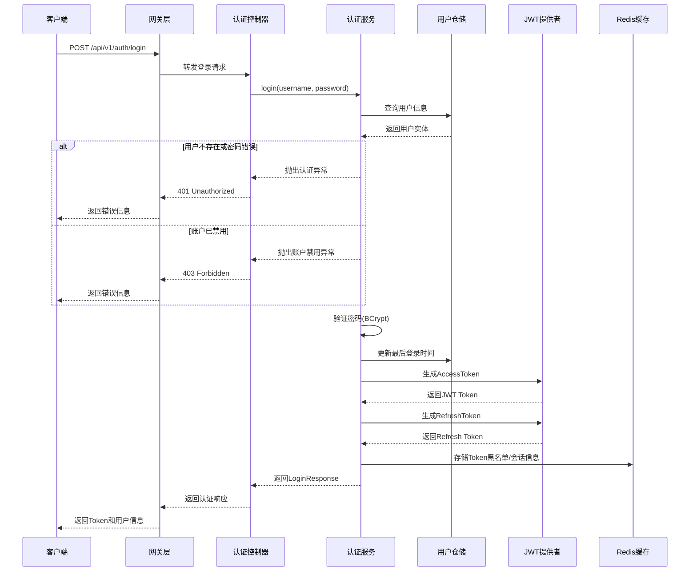
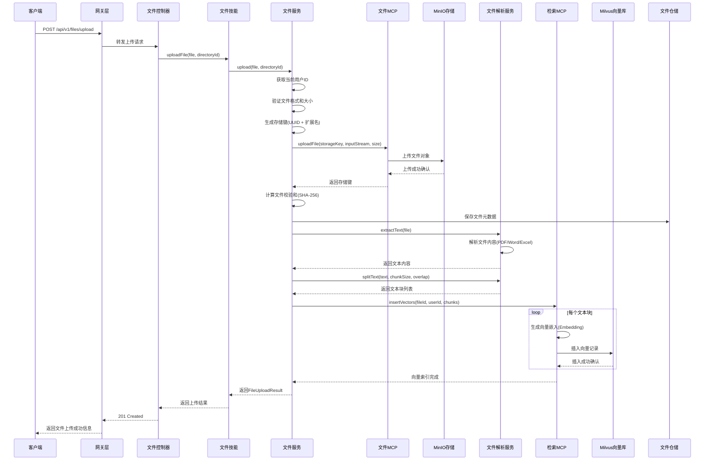
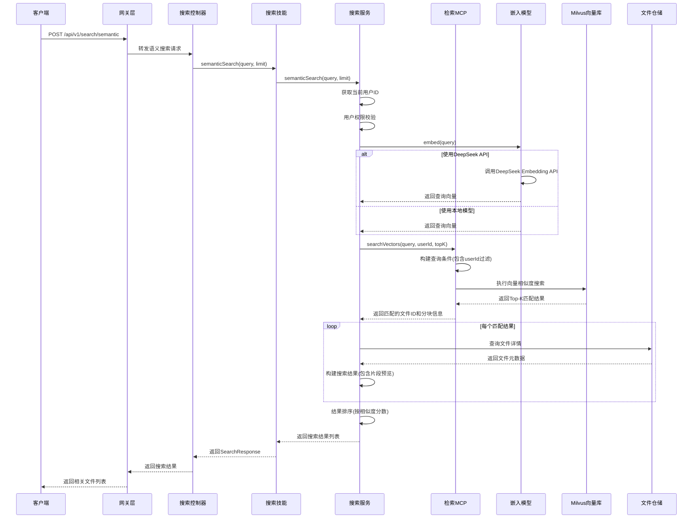
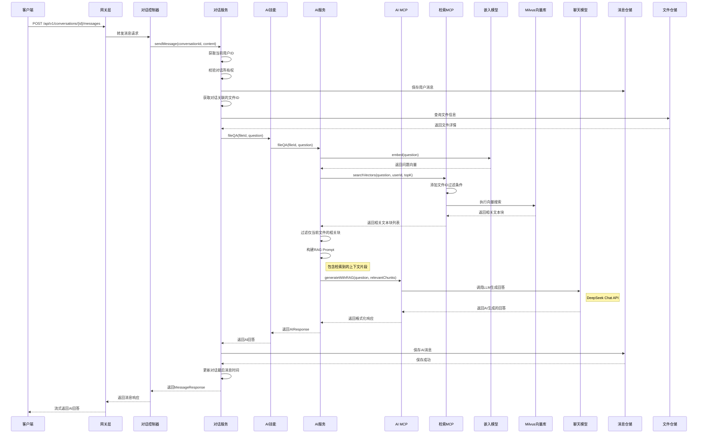
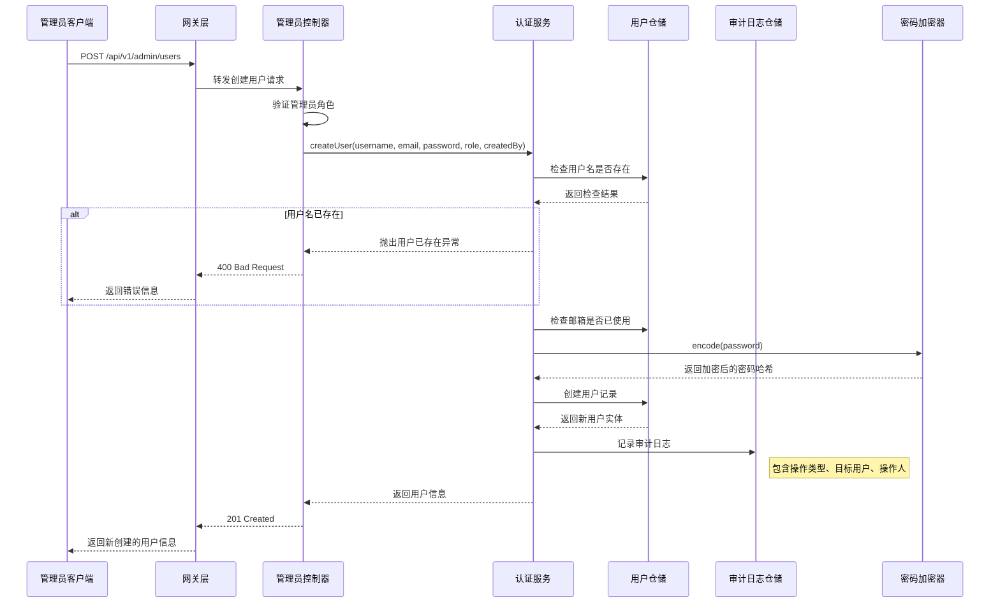
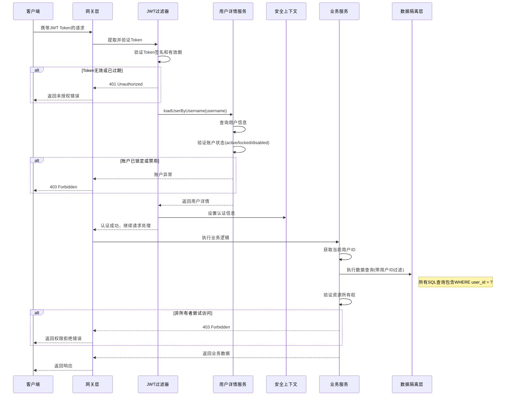

# 技术设计文档

**项目名称**: 智能文件管理与问答检索系统
**版本**: 2.0
**编写日期**: 2026-05-25
**状态**: Draft

***

## 1. 概述

本文档是智能文件管理与问答检索系统的技术设计文档，基于以下技术栈进行设计：

| 分类        | 技术选型                         | 版本     |
| --------- | ---------------------------- | ------ |
| **语言**    | Java                         | 21     |
| **框架**    | Spring Boot                  | 3.2.x  |
| **向量数据库** | Milvus                       | 2.4.x  |
| **AI框架**  | LangChain4J                  | 0.29.x |
| **LLM**   | DeepSeek                     | API    |
| **开发模式**  | Harness Agent + Skills + MCP | -      |

### 1.1 设计原则

- **安全性**: 所有接口必须身份验证，遵循最小权限原则
- **可扩展性**: 模块化设计，支持水平扩展
- **高性能**: 优化查询性能，支持高并发
- **可维护性**: 代码规范，日志完善，监控到位
- **Agent化**: 采用Harness Agent模式，支持技能组合

***

## 2. 系统架构

### 2.1 整体架构图

```
┌─────────────────────────────────────────────────────────────────────────┐
│                         Client Layer                                   │
│  ┌─────────────┐  ┌─────────────┐  ┌─────────────┐                    │
│  │   Web浏览器   │  │   移动端    │  │  Harness UI │                    │
│  └──────┬──────┘  └──────┬──────┘  └──────┬──────┘                    │
└─────────┼────────────────┼────────────────┼────────────────────────────┘
          │                │                │
          └────────────────┼────────────────┘
                           │ HTTPS
          ┌────────────────▼────────────────┐
          │           Gateway Layer          │
          │  ┌────────────────────────────┐ │
          │  │     Spring Cloud Gateway    │ │
          │  │   - SSL终端                │ │
          │  │   - 路由转发               │ │
          │  │   - 请求限流                │ │
          │  └────────────────────────────┘ │
          └────────────────┬────────────────┘
                           │
          ┌────────────────▼────────────────┐
          │         Service Layer           │
          │  ┌────────────────────────────┐ │
          │  │      Spring Boot App        │ │
          │  │   ┌─────────────────────┐   │ │
          │  │   │   Controller层       │   │ │
          │  │   ├─────────────────────┤   │ │
          │  │   │   Service层         │   │ │
          │  │   ├─────────────────────┤   │ │
          │  │   │   Repository层      │   │ │
          │  │   └─────────────────────┘   │ │
          │  │   ┌─────────────────────┐   │ │
          │  │   │   Harness Agent     │   │ │
          │  │   │   (Skills/MCP)      │   │ │
          │  │   └─────────────────────┘   │ │
          │  └────────────────────────────┘ │
          └────────────────┬────────────────┘
                           │
          ┌────────────────▼────────────────┐
          │           Data Layer            │
          │  ┌─────────────┐ ┌─────────────┐ │
          │  │  PostgreSQL │ │    Redis    │ │
          │  │  (主从复制)  │ │  (缓存/会话) │ │
          │  └─────────────┘ └─────────────┘ │
          │  ┌─────────────┐ ┌─────────────┐ │
          │  │   MinIO     │ │   Milvus    │ │
          │  │  (对象存储)  │ │ (向量数据库) │ │
          │  └─────────────┘ └─────────────┘ │
          └─────────────────────────────────┘
                           │
          ┌────────────────▼────────────────┐
          │       External Services         │
          │  ┌─────────────┐ ┌─────────────┐ │
          │  │  DeepSeek   │ │   Harness   │ │
          │  │    API      │ │  Platform   │ │
          │  └─────────────┘ └─────────────┘ │
          └─────────────────────────────────┘
```

### 2.2 技术栈详细说明

| 组件 | 技术选型 | 说明 |
|------|----------|------|
| **语言** | Java 21 | LTS版本，支持虚拟线程 |
| **框架** | Spring Boot 3.2.x | 社区成熟，生态完善 |
| **关系数据库** | MySQL 8.2+ | 主流关系型数据库，性能稳定 |
| **ORM框架** | MyBatis 3.5.x | 灵活的SQL映射框架 |
| **缓存** | Redis 7.x | 会话存储、缓存层 |
| **文件存储** | 华为云 OBS | 企业级对象存储服务 |
| **向量数据库** | Milvus 2.4.x | 高性能向量数据库 |
| **AI框架** | LangChain4J 0.30.x | Java版LangChain，最新稳定版 |
| **LLM** | DeepSeek API | 国产大模型，性价比高 |
| **Agent平台** | Harness Agent | 支持Skills和MCP模式 |
| **构建工具** | Maven | 依赖管理 |

### 2.3 项目目录结构设计

本项目采用**传统分层架构 + AI Harness 架构**的混合模式，将业务逻辑与 AI 智能逻辑清晰分离：

```
src/main/java/com/example/ragchat/
│
├── controller/                          # 传统 Controller 层（处理 HTTP 请求）
│   ├── AuthController.java              # 认证相关接口
│   ├── FileController.java              # 文件管理接口
│   ├── DirectoryController.java          # 目录管理接口
│   ├── SearchController.java            # 搜索接口
│   ├── ConversationController.java      # 对话管理接口
│   └── admin/                           # 管理员接口
│       └── AdminController.java         # 用户管理接口
│
├── service/                             # 传统 Service 层（基础业务逻辑）
│   ├── UserService.java                 # 用户管理
│   ├── FileService.java                 # 文件管理
│   ├── DirectoryService.java            # 目录管理
│   ├── AuditLogService.java             # 审计日志
│   └── impl/                            # Service 实现
│
├── serviceAi/                           # AI Service 层（智能业务逻辑）
│   │                                     # AI Harness 架构核心
│   ├── harness/                         # Harness 核心
│   │   ├── RagChatAgent.java           # Agent 核心接口
│   │   └── RagChatAgentImpl.java       # Agent 实现
│   │
│   ├── intent/                          # Intent 识别层
│   │   ├── IntentRecognizer.java       # 意图识别接口
│   │   ├── IntentRecognizerImpl.java   # 意图识别实现
│   │   ├── Intent.java                 # 意图对象
│   │   └── IntentType.java             # 意图类型枚举
│   │
│   ├── scheduler/                       # 技能调度层
│   │   ├── SkillScheduler.java         # 调度器接口
│   │   └── SkillSchedulerImpl.java     # 调度器实现
│   │
│   ├── context/                         # 上下文管理层
│   │   ├── ContextManager.java         # 上下文管理器接口
│   │   ├── ContextManagerImpl.java     # 上下文管理器实现
│   │   ├── ConversationContext.java     # 对话上下文
│   │   └── UserPreferences.java        # 用户偏好
│   │
│   ├── skills/                         # Skills 层（业务技能封装）
│   │   ├── Skill.java                  # 技能基础接口
│   │   ├── FileSkill.java             # 文件操作技能
│   │   ├── SearchSkill.java           # 搜索技能
│   │   └── AISkill.java               # AI 技能
│   │
│   ├── mcp/                            # MCP 层（外部系统适配）
│   │   ├── MCP.java                    # MCP 基础接口
│   │   ├── FileMCP.java               # 文件操作 MCP（MinIO）
│   │   ├── SearchMCP.java             # 检索服务 MCP（Milvus）
│   │   └── AIMCP.java                 # LLM 调用 MCP（DeepSeek）
│   │
│   └── dto/                           # AI 层专用 DTO
│       ├── AgentRequest.java          # Agent 请求
│       ├── AgentResponse.java         # Agent 响应
│       ├── SkillResult.java           # 技能执行结果
│       └── ChatMessage.java           # 聊天消息
│
├── dao/                               # DAO 层（数据访问）
│   ├── UserRepository.java
│   ├── FileRepository.java
│   ├── DirectoryRepository.java
│   ├── ConversationRepository.java
│   ├── MessageRepository.java
│   └── AuditLogRepository.java
│
├── entity/                             # 实体类
│   ├── User.java
│   ├── File.java
│   ├── Directory.java
│   ├── Conversation.java
│   ├── Message.java
│   └── AuditLog.java
│
├── config/                             # 配置类
│   ├── SecurityConfig.java
│   ├── MilvusConfig.java
│   ├── MinioConfig.java
│   ├── RedisConfig.java
│   ├── DeepSeekConfig.java
│   └── WebConfig.java
│
├── security/                           # 安全组件
│   ├── JwtTokenProvider.java
│   ├── JwtAuthenticationFilter.java
│   └── UserDetailsServiceImpl.java
│
├── exception/                          # 异常处理
│   ├── GlobalExceptionHandler.java
│   └── BusinessException.java
│
└── util/                               # 工具类
    ├── FileUtils.java
    ├── EncryptionUtils.java
    └── DateUtils.java
```

### 2.4 架构分层职责说明

| 层级               | 包名            | 职责                           | 技术栈                   |
| ---------------- | ------------- | ---------------------------- | --------------------- |
| **Controller 层** | `controller/` | 接收 HTTP 请求，参数校验，调用 Service 层 | Spring MVC            |
| **Service 层**    | `service/`    | 处理基础业务逻辑（CRUD、权限校验）          | Spring @Service       |
| **DAO 层**        | `dao/`        | 数据访问，与数据库交互                  | Spring Data JPA       |
| **Entity 层**     | `entity/`     | 实体映射，数据库表结构                  | JPA/Hibernate         |
| **ServiceAI 层**  | `serviceAi/`  | AI 智能业务编排（核心创新点）             | 自研 + LangChain4J      |
| **Config 层**     | `config/`     | 框架配置，Bean 管理                 | Spring @Configuration |

### 2.5 ServiceAI 层内部架构

`serviceAi/` 采用 **Harness AI 架构**，内部包含完整的 AI 处理链路：

```
serviceAi/
│
├── harness/                      # Agent 核心
│   ├── RagChatAgent            # AI 入口，接收请求
│   └── RagChatAgentImpl        # 调度流程控制
│
├── intent/                       # 意图识别层
│   ├── IntentRecognizer        # 识别用户意图
│   └── IntentType              # 意图枚举（13种）
│
├── scheduler/                    # 技能调度层
│   └── SkillScheduler          # 根据意图路由到技能
│
├── context/                      # 上下文管理层
│   ├── ContextManager          # 会话状态、用户偏好
│   └── ConversationContext     # 上下文对象
│
├── skills/                       # 业务技能层
│   ├── FileSkill               # 文件操作技能
│   ├── SearchSkill             # 搜索技能
│   └── AISkill                 # AI 对话技能
│
└── mcp/                         # MCP 适配层
    ├── FileMCP                  # MinIO 文件存储
    ├── SearchMCP                # Milvus 向量检索
    └── AIMCP                    # DeepSeek LLM 调用
```

### 2.6 分层调用流程

```
HTTP 请求
    │
    ▼
┌──────────────┐
│ Controller   │  ← 接收请求，参数校验
└──────┬───────┘
       │ 调用
       ▼
┌──────────────┐
│  Service     │  ← 基础业务逻辑处理
└──────┬───────┘
       │ 调用（AI 场景）
       ▼
┌──────────────┐
│ ServiceAI    │  ← AI 智能处理
│              │
│  ┌───────────▼──────────┐
│  │      Harness        │
│  │  Intent → Agent     │
│  │  → Skills → MCP     │
│  └─────────────────────┘
└──────┬───────┘
       │
       ▼
┌──────────────┐
│    DAO      │  ← 数据持久化
└──────┬───────┘
       │
       ▼
   数据存储
```

\| **容器化** | Docker + K8s | 容器编排 |

***

## 3. Harness Agent设计

### 3.1 Agent架构

```
┌─────────────────────────────────────────────────────────────────┐
│                        Harness Agent                            │
│  ┌───────────────────────────────────────────────────────────┐  │
│  │                    Agent Core                             │  │
│  │  - 会话管理                                                │  │
│  │  - 技能调度                                                │  │
│  │  - 上下文管理                                              │  │
│  └───────────────────────────────────────────────────────────┘  │
│                              │                                 │
│         ┌────────────────────┼────────────────────┐            │
│         ▼                    ▼                    ▼            │
│  ┌─────────────┐    ┌─────────────┐    ┌─────────────┐        │
│  │  FileSkill  │    │ SearchSkill │    │  AISkill    │        │
│  │  - 上传     │    │  - 关键词    │    │  - 问答     │        │
│  │  - 下载     │    │  - 语义      │    │  - 总结     │        │
│  │  - 删除     │    │  - 自然语言   │    │  - 分析     │        │
│  └─────────────┘    └─────────────┘    └─────────────┘        │
│         │                    │                    │            │
│         └────────────────────┼────────────────────┘            │
│                              │                                 │
│  ┌───────────────────────────▼───────────────────────────┐      │
│  │                      MCP Layer                        │      │
│  │  ┌─────────────┐ ┌─────────────┐ ┌─────────────┐      │      │
│  │  │ FileMCP     │ │ SearchMCP   │ │ AIMCP       │      │      │
│  │  │ (文件操作)   │ │ (检索服务)   │ │ (LLM调用)   │      │      │
│  │  └─────────────┘ └─────────────┘ └─────────────┘      │      │
│  └───────────────────────────────────────────────────────┘      │
└─────────────────────────────────────────────────────────────────┘
```

### 3.2 Skill定义

#### 3.2.1 FileSkill（文件操作技能）

```java
@Skill(name = "文件操作", description = "用于文件的上传、下载、删除等操作")
public class FileSkill {

    @SkillFunction(name = "上传文件", description = "上传单个文件到指定目录")
    public FileUploadResult uploadFile(
            @SkillParameter(name = "file", description = "文件内容") MultipartFile file,
            @SkillParameter(name = "directoryId", description = "目标目录ID", required = false) String directoryId) {
        // 实现文件上传逻辑
        return fileService.upload(file, directoryId);
    }

    @SkillFunction(name = "下载文件", description = "下载指定文件")
    public Resource downloadFile(
            @SkillParameter(name = "fileId", description = "文件ID") String fileId) {
        // 实现文件下载逻辑
        return fileService.download(fileId);
    }

    @SkillFunction(name = "删除文件", description = "删除指定文件")
    public void deleteFile(
            @SkillParameter(name = "fileId", description = "文件ID") String fileId) {
        // 实现文件删除逻辑
        fileService.delete(fileId);
    }

    @SkillFunction(name = "创建目录", description = "创建新目录")
    public Directory createDirectory(
            @SkillParameter(name = "name", description = "目录名称") String name,
            @SkillParameter(name = "parentId", description = "父目录ID", required = false) String parentId) {
        // 实现目录创建逻辑
        return directoryService.create(name, parentId);
    }

    @SkillFunction(name = "获取文件列表", description = "获取指定目录下的文件列表")
    public List<FileInfo> listFiles(
            @SkillParameter(name = "directoryId", description = "目录ID", required = false) String directoryId) {
        // 实现文件列表获取逻辑
        return fileService.list(directoryId);
    }
}
```

#### 3.2.2 SearchSkill（搜索技能）

```java
@Skill(name = "搜索技能", description = "用于文件内容的搜索和检索")
public class SearchSkill {

    @SkillFunction(name = "关键词搜索", description = "通过关键词搜索文件")
    public List<SearchResult> keywordSearch(
            @SkillParameter(name = "query", description = "搜索关键词") String query,
            @SkillParameter(name = "directoryId", description = "限定目录", required = false) String directoryId) {
        // 实现关键词搜索逻辑
        return searchService.keywordSearch(query, directoryId);
    }

    @SkillFunction(name = "语义搜索", description = "通过自然语言描述搜索文件")
    public List<SearchResult> semanticSearch(
            @SkillParameter(name = "query", description = "自然语言查询") String query,
            @SkillParameter(name = "limit", description = "返回数量", required = false) Integer limit) {
        // 实现语义搜索逻辑
        return searchService.semanticSearch(query, limit != null ? limit : 10);
    }

    @SkillFunction(name = "高级搜索", description = "组合条件搜索")
    public List<SearchResult> advancedSearch(
            @SkillParameter(name = "keywords", description = "关键词列表") List<String> keywords,
            @SkillParameter(name = "fileType", description = "文件类型", required = false) String fileType,
            @SkillParameter(name = "startDate", description = "开始日期", required = false) LocalDate startDate,
            @SkillParameter(name = "endDate", description = "结束日期", required = false) LocalDate endDate) {
        // 实现高级搜索逻辑
        return searchService.advancedSearch(keywords, fileType, startDate, endDate);
    }
}
```

#### 3.2.3 AISkill（AI技能）

```java
@Skill(name = "AI技能", description = "用于与AI进行对话和问答")
public class AISkill {

    @SkillFunction(name = "文件问答", description = "基于指定文件进行问答")
    public AIResponse fileQA(
            @SkillParameter(name = "fileId", description = "文件ID") String fileId,
            @SkillParameter(name = "question", description = "问题") String question) {
        // 实现文件问答逻辑
        return aiService.fileQA(fileId, question);
    }

    @SkillFunction(name = "多文件问答", description = "基于多个文件进行问答")
    public AIResponse multiFileQA(
            @SkillParameter(name = "fileIds", description = "文件ID列表") List<String> fileIds,
            @SkillParameter(name = "question", description = "问题") String question) {
        // 实现多文件问答逻辑
        return aiService.multiFileQA(fileIds, question);
    }

    @SkillFunction(name = "总结文件", description = "总结文件内容")
    public AIResponse summarizeFile(
            @SkillParameter(name = "fileId", description = "文件ID") String fileId) {
        // 实现文件总结逻辑
        return aiService.summarize(fileId);
    }

    @SkillFunction(name = "分析对比", description = "对比分析多个文件")
    public AIResponse analyzeCompare(
            @SkillParameter(name = "fileIds", description = "文件ID列表") List<String> fileIds,
            @SkillParameter(name = "analysisType", description = "分析类型") String analysisType) {
        // 实现分析对比逻辑
        return aiService.analyzeCompare(fileIds, analysisType);
    }
}
```

### 3.3 MCP定义

#### 3.3.1 FileMCP（文件操作MCP）

```java
@Component
public class FileMCP {

    @Autowired
    private MinioClient minioClient;

    @Autowired
    private FileRepository fileRepository;

    public String uploadFile(String bucket, String objectName, InputStream inputStream, long size) {
        try {
            minioClient.putObject(
                    PutObjectArgs.builder()
                            .bucket(bucket)
                            .object(objectName)
                            .stream(inputStream, size, -1)
                            .build()
            );
            return objectName;
        } catch (Exception e) {
            throw new RuntimeException("文件上传失败", e);
        }
    }

    public InputStream downloadFile(String bucket, String objectName) {
        try {
            return minioClient.getObject(
                    GetObjectArgs.builder()
                            .bucket(bucket)
                            .object(objectName)
                            .build()
            );
        } catch (Exception e) {
            throw new RuntimeException("文件下载失败", e);
        }
    }

    public void deleteFile(String bucket, String objectName) {
        try {
            minioClient.removeObject(
                    RemoveObjectArgs.builder()
                            .bucket(bucket)
                            .object(objectName)
                            .build()
            );
        } catch (Exception e) {
            throw new RuntimeException("文件删除失败", e);
        }
    }
}
```

#### 3.3.2 SearchMCP（检索MCP）

```java
@Component
public class SearchMCP {

    @Autowired
    private MilvusClient milvusClient;

    @Autowired
    private EmbeddingService embeddingService;

    public List<Long> searchVectors(String collectionName, float[] queryVector, int topK) {
        try {
            SearchParam searchParam = SearchParam.newBuilder()
                    .withCollectionName(collectionName)
                    .withMetricType(MetricType.L2)
                    .withTopK(topK)
                    .withVectors(Collections.singletonList(queryVector))
                    .build();
            
            R<SearchResults> results = milvusClient.search(searchParam);
            // 解析返回结果
            return parseResults(results);
        } catch (Exception e) {
            throw new RuntimeException("向量搜索失败", e);
        }
    }

    public void insertVectors(String collectionName, List<float[]> vectors, List<String> fileIds) {
        try {
            InsertParam insertParam = InsertParam.newBuilder()
                    .withCollectionName(collectionName)
                    .withFields(Arrays.asList(
                            new Field("file_id", DataType.VARCHAR, fileIds),
                            new Field("embedding", DataType.FLOAT_VECTOR, vectors)
                    ))
                    .build();
            
            milvusClient.insert(insertParam);
            milvusClient.flush(FlushParam.newBuilder()
                    .withCollectionNames(Collections.singletonList(collectionName))
                    .build());
        } catch (Exception e) {
            throw new RuntimeException("向量插入失败", e);
        }
    }
}
```

#### 3.3.3 AIMCP（LLM调用MCP）

```java
@Component
public class AIMCP {

    @Autowired
    private DeepSeekChatModel chatModel;

    @Autowired
    private PromptTemplate promptTemplate;

    public String generateResponse(String prompt, List<String> context) {
        String formattedPrompt = promptTemplate.format(prompt, context);
        
        ChatRequest chatRequest = ChatRequest.builder()
                .model("deepseek-chat")
                .messages(Collections.singletonList(
                        ChatMessage.userMessage(formattedPrompt)
                ))
                .maxTokens(4096)
                .temperature(0.7)
                .build();
        
        ChatResponse response = chatModel.generate(chatRequest);
        return response.getContent();
    }

    public String generateWithRAG(String question, List<String> relevantChunks) {
        String ragPrompt = buildRAGPrompt(question, relevantChunks);
        return generateResponse(ragPrompt, relevantChunks);
    }

    private String buildRAGPrompt(String question, List<String> chunks) {
        StringBuilder context = new StringBuilder();
        for (String chunk : chunks) {
            context.append(chunk).append("\n\n");
        }
        
        return String.format("""
                基于以下参考文档回答问题：
                
                %s
                
                问题：%s
                
                请根据文档内容回答，不要编造信息。如果文档中没有相关信息，请说明"文档中未找到相关信息"。
                """, context.toString(), question);
    }
}
```

### 3.4 Agent工作流程

```
┌──────────────────────────────────────────────────────────────────────┐
│                        Agent工作流程                                │
├──────────────────────────────────────────────────────────────────────┤
│                                                                    │
│  用户请求                                                           │
│       │                                                             │
│       ▼                                                             │
│  ┌──────────────┐                                                   │
│  │  请求解析    │                                                   │
│  │  (意图识别)  │                                                   │
│  └──────┬───────┘                                                   │
│         ▼                                                           │
│  ┌──────────────┐                                                   │
│  │  技能选择    │                                                   │
│  │  (路由决策)  │                                                   │
│  └──────┬───────┘                                                   │
│         │                                                           │
│    ┌────┴────┬────────────┐                                        │
│    ▼         ▼            ▼                                        │
│ ┌───────┐ ┌───────┐  ┌───────┐                                     │
│ │File   │ │Search │  │AI     │                                     │
│ │Skill  │ │Skill  │  │Skill  │                                     │
│ └───┬───┘ └───┬───┘  └───┬───┘                                     │
│     │         │         │                                          │
│     ▼         ▼         ▼                                          │
│ ┌───────┐ ┌───────┐  ┌───────┐                                     │
│ │File   │ │Search │  │AI     │                                     │
│ │MCP    │ │MCP    │  │MCP    │                                     │
│ └───┬───┘ └───┬───┘  └───┬───┘                                     │
│     │         │         │                                          │
│     └─────────┴────┬────┘                                          │
│                    ▼                                                │
│  ┌──────────────┐                                                   │
│  │  结果整合    │                                                   │
│  │  (响应生成)  │                                                   │
│  └──────┬───────┘                                                   │
│         ▼                                                           │
│     返回响应                                                         │
│                                                                    │
└──────────────────────────────────────────────────────────────────────┘
```

### 3.5 Agent 核心调度接口定义

#### 3.5.1 Agent 核心接口

```java
/**
 * Harness Agent 核心接口
 * 负责会话管理、意图识别、技能调度和上下文管理
 */
public interface RagChatAgent {

    /**
     * 处理用户请求的入口方法
     * @param request 用户请求
     * @param context 对话上下文
     * @return 处理响应
     */
    AgentResponse processRequest(AgentRequest request, ConversationContext context);

    /**
     * 获取当前会话状态
     * @param sessionId 会话ID
     * @return 会话状态
     */
    SessionState getSessionState(String sessionId);

    /**
     * 结束会话
     * @param sessionId 会话ID
     */
    void endSession(String sessionId);

    /**
     * 更新会话上下文
     * @param sessionId 会话ID
     * @param context 上下文数据
     */
    void updateContext(String sessionId, Map<String, Object> context);
}
```

#### 3.5.2 意图识别器接口

```java
/**
 * 意图识别器接口
 * 负责解析用户请求，识别用户意图
 */
public interface IntentRecognizer {

    /**
     * 识别用户意图
     * @param input 用户输入文本
     * @param context 对话上下文
     * @return 识别到的意图
     */
    Intent recognize(String input, ConversationContext context);

    /**
     * 获取意图置信度
     * @param intent 意图
     * @return 置信度 (0-1)
     */
    double getConfidence(Intent intent);
}

/**
 * 意图枚举
 */
public enum IntentType {
    FILE_UPLOAD,      // 文件上传
    FILE_DOWNLOAD,    // 文件下载
    FILE_DELETE,      // 文件删除
    FILE_LIST,        // 文件列表
    DIRECTORY_CREATE, // 创建目录
    KEYWORD_SEARCH,   // 关键词搜索
    SEMANTIC_SEARCH,  // 语义搜索
    ADVANCED_SEARCH,  // 高级搜索
    FILE_QA,          // 文件问答
    MULTI_FILE_QA,    // 多文件问答
    FILE_SUMMARIZE,   // 文件总结
    ANALYZE_COMPARE,  // 分析对比
    UNKNOWN           // 未知意图
}

/**
 * 意图对象
 */
public class Intent {
    private IntentType type;
    private Map<String, String> parameters;
    private double confidence;
    // getter/setter
}
```

#### 3.5.3 技能调度器接口

```java
/**
 * 技能调度器接口
 * 负责根据意图选择并调用合适的技能
 */
public interface SkillScheduler {

    /**
     * 根据意图调度技能
     * @param intent 识别到的意图
     * @param context 对话上下文
     * @return 技能执行结果
     */
    SkillResult schedule(Intent intent, ConversationContext context);

    /**
     * 注册技能
     * @param skill 技能实例
     */
    void registerSkill(Skill skill);

    /**
     * 获取已注册的技能列表
     * @return 技能列表
     */
    List<Skill> getRegisteredSkills();

    /**
     * 根据意图类型获取对应的技能
     * @param intentType 意图类型
     * @return 技能实例
     */
    Skill getSkillForIntent(IntentType intentType);
}
```

#### 3.5.4 上下文管理器接口

```java
/**
 * 上下文管理器接口
 * 负责管理会话上下文、历史记录和用户状态
 */
public interface ContextManager {

    /**
     * 创建新会话
     * @param userId 用户ID
     * @return 新会话ID
     */
    String createSession(String userId);

    /**
     * 获取会话上下文
     * @param sessionId 会话ID
     * @return 对话上下文
     */
    ConversationContext getContext(String sessionId);

    /**
     * 更新上下文
     * @param sessionId 会话ID
     * @param updates 更新内容
     */
    void updateContext(String sessionId, Map<String, Object> updates);

    /**
     * 添加消息到历史记录
     * @param sessionId 会话ID
     * @param message 消息对象
     */
    void addMessage(String sessionId, ChatMessage message);

    /**
     * 获取会话历史记录
     * @param sessionId 会话ID
     * @param limit 返回条数限制
     * @return 消息列表
     */
    List<ChatMessage> getHistory(String sessionId, int limit);

    /**
     * 删除会话
     * @param sessionId 会话ID
     */
    void deleteSession(String sessionId);

    /**
     * 获取用户偏好设置
     * @param userId 用户ID
     * @return 用户偏好
     */
    UserPreferences getUserPreferences(String userId);

    /**
     * 保存用户偏好设置
     * @param userId 用户ID
     * @param preferences 用户偏好
     */
    void saveUserPreferences(String userId, UserPreferences preferences);
}

/**
 * 对话上下文
 */
public class ConversationContext {
    private String sessionId;
    private String userId;
    private String currentFileId;
    private String currentDirectoryId;
    private List<ChatMessage> history;
    private LocalDateTime lastActiveTime;
    private Map<String, Object> metadata;
    // getter/setter
}

/**
 * 用户偏好设置
 */
public class UserPreferences {
    private String userId;
    private String defaultDirectoryId;
    private Integer searchLimit;
    private Boolean autoSummarize;
    private String preferredLanguage;
    // getter/setter
}
```

#### 3.5.5 Agent 调度核心实现类

```java
/**
 * Harness Agent 核心调度实现
 */
@Component
public class RagChatAgentImpl implements RagChatAgent {

    @Autowired
    private IntentRecognizer intentRecognizer;

    @Autowired
    private SkillScheduler skillScheduler;

    @Autowired
    private ContextManager contextManager;

    @Override
    public AgentResponse processRequest(AgentRequest request, ConversationContext context) {
        // 更新会话活跃时间
        context.setLastActiveTime(LocalDateTime.now());
        contextManager.updateContext(context.getSessionId(), 
            Map.of("lastActiveTime", context.getLastActiveTime()));

        // 意图识别
        Intent intent = intentRecognizer.recognize(request.getInput(), context);
        
        // 记录用户消息
        ChatMessage userMessage = ChatMessage.builder()
            .role(Role.USER)
            .content(request.getInput())
            .timestamp(LocalDateTime.now())
            .build();
        contextManager.addMessage(context.getSessionId(), userMessage);

        // 技能调度
        SkillResult skillResult = skillScheduler.schedule(intent, context);

        // 记录回复消息
        if (skillResult.getOutput() != null) {
            ChatMessage assistantMessage = ChatMessage.builder()
                .role(Role.ASSISTANT)
                .content(skillResult.getOutput())
                .timestamp(LocalDateTime.now())
                .build();
            contextManager.addMessage(context.getSessionId(), assistantMessage);
        }

        // 构建响应
        return AgentResponse.builder()
            .status(skillResult.isSuccess() ? Status.SUCCESS : Status.ERROR)
            .content(skillResult.getOutput())
            .intent(intent.getType())
            .confidence(intent.getConfidence())
            .build();
    }
}
```

#### 3.5.6 技能调度器实现

```java
/**
 * 技能调度器实现
 */
@Component
public class SkillSchedulerImpl implements SkillScheduler {

    private final Map<IntentType, Skill> skillMap = new ConcurrentHashMap<>();

    @Autowired
    private FileSkill fileSkill;

    @Autowired
    private SearchSkill searchSkill;

    @Autowired
    private AISkill aiSkill;

    @PostConstruct
    public void init() {
        // 注册技能与意图的映射关系
        skillMap.put(IntentType.FILE_UPLOAD, fileSkill);
        skillMap.put(IntentType.FILE_DOWNLOAD, fileSkill);
        skillMap.put(IntentType.FILE_DELETE, fileSkill);
        skillMap.put(IntentType.FILE_LIST, fileSkill);
        skillMap.put(IntentType.DIRECTORY_CREATE, fileSkill);
        
        skillMap.put(IntentType.KEYWORD_SEARCH, searchSkill);
        skillMap.put(IntentType.SEMANTIC_SEARCH, searchSkill);
        skillMap.put(IntentType.ADVANCED_SEARCH, searchSkill);
        
        skillMap.put(IntentType.FILE_QA, aiSkill);
        skillMap.put(IntentType.MULTI_FILE_QA, aiSkill);
        skillMap.put(IntentType.FILE_SUMMARIZE, aiSkill);
        skillMap.put(IntentType.ANALYZE_COMPARE, aiSkill);
    }

    @Override
    public SkillResult schedule(Intent intent, ConversationContext context) {
        Skill skill = getSkillForIntent(intent.getType());
        
        if (skill == null) {
            return SkillResult.failure("未找到处理该意图的技能: " + intent.getType());
        }

        try {
            // 执行技能
            Object result = skill.execute(intent.getParameters(), context);
            
            return SkillResult.success(result != null ? result.toString() : "操作成功");
        } catch (Exception e) {
            log.error("技能执行失败", e);
            return SkillResult.failure("技能执行失败: " + e.getMessage());
        }
    }

    @Override
    public Skill getSkillForIntent(IntentType intentType) {
        return skillMap.get(intentType);
    }

    // ... 其他方法实现
}
```

#### 3.5.7 技能执行器接口

```java
/**
 * 技能执行器接口
 * 所有技能必须实现此接口
 */
public interface Skill {

    /**
     * 获取技能名称
     * @return 技能名称
     */
    String getName();

    /**
     * 获取技能描述
     * @return 技能描述
     */
    String getDescription();

    /**
     * 执行技能
     * @param parameters 参数映射
     * @param context 对话上下文
     * @return 执行结果
     */
    Object execute(Map<String, String> parameters, ConversationContext context) throws Exception;

    /**
     * 获取支持的意图类型列表
     * @return 意图类型列表
     */
    List<IntentType> getSupportedIntents();
}

/**
 * 技能执行结果
 */
public class SkillResult {
    private boolean success;
    private String output;
    private String errorMessage;
    
    public static SkillResult success(String output) {
        SkillResult result = new SkillResult();
        result.success = true;
        result.output = output;
        return result;
    }
    
    public static SkillResult failure(String errorMessage) {
        SkillResult result = new SkillResult();
        result.success = false;
        result.errorMessage = errorMessage;
        return result;
    }
    // getter/setter
}
```

#### 3.5.8 请求/响应对象

```java
/**
 * Agent 请求对象
 */
public class AgentRequest {
    private String sessionId;
    private String userId;
    private String input;
    private Map<String, Object> metadata;
    // getter/setter
}

/**
 * Agent 响应对象
 */
public class AgentResponse {
    private Status status;
    private String content;
    private IntentType intent;
    private double confidence;
    private Map<String, Object> metadata;
    
    public enum Status {
        SUCCESS, ERROR, PARTIAL
    }
    // getter/setter + builder
}

/**
 * 聊天消息对象
 */
public class ChatMessage {
    private String id;
    private Role role;
    private String content;
    private LocalDateTime timestamp;
    private String fileId; // 关联的文件ID
    
    public enum Role {
        USER, ASSISTANT, SYSTEM
    }
    // getter/setter + builder
}
```

***

## 4. 数据库设计

### 4.1 ER图

```
┌─────────────────┐       ┌─────────────────┐
│     users       │       │   directories   │
├─────────────────┤       ├─────────────────┤
│ id (PK)         │       │ id (PK)         │
│ username        │       │ name            │
│ email           │       │ parent_id (FK)  │──┐
│ password_hash   │       │ user_id (FK)    │──┼──┐
│ role            │       │ created_at      │  │  │
│ status          │       │ updated_at      │  │  │
│ created_at      │       └─────────────────┘  │  │
│ updated_at      │                              │
│ last_login_at   │       ┌─────────────────┐  │
└────────┬────────┘       │      files       │  │
         │                ├─────────────────┤  │
         │                │ id (PK)         │  │
         │                │ filename         │  │
         │                │ file_path        │◄─┼──┘
         │                │ file_size        │  │
         │                │ file_type        │  │
         │                │ directory_id(FK) │──┤
         │                │ user_id (FK)    │◄─┘
         │                │ version         │
         │                │ storage_key     │
         │                │ checksum        │
         │                │ created_at      │
         │                │ updated_at      │
         │                └────────┬────────┘
         │                         │
         │                ┌────────▼────────┐
         │                │ file_versions   │
         │                ├─────────────────┤
         │                │ id (PK)         │
         │                │ file_id (FK)    │
         │                │ version_number   │
         │                │ file_path       │
         │                │ file_size       │
         │                │ created_at      │
         │                └─────────────────┘
         │
         │                ┌─────────────────┐
         │                │  conversations  │
         │                ├─────────────────┤
         │                │ id (PK)         │
         │                │ user_id (FK)    │◄─┐
         │                │ file_id (FK)    │──┼──┐
         │                │ title           │  │  │
         │                │ created_at      │  │  │
         │                │ updated_at      │  │  │
         │                └────────┬────────┘  │  │
         │                         │            │  │
         │                ┌────────▼────────┐  │  │
         │                │  messages       │  │  │
         │                ├─────────────────┤  │  │
         │                │ id (PK)         │  │  │
         │                │ conversation_id │◄─┘  │
         │                │ role            │      │
         │                │ content         │      │
         │                │ metadata        │      │
         │                │ created_at      │      │
         │                └─────────────────┘      │
         │
         │                ┌─────────────────┐
         └───────────────►│  audit_logs     │
                          ├─────────────────┤
                          │ id (PK)         │
                          │ user_id (FK)    │
                          │ action          │
                          │ resource_type   │
                          │ resource_id     │
                          │ ip_address      │
                          │ user_agent      │
                          │ details         │
                          │ created_at      │
                          └─────────────────┘
```

### 4.2 数据表详细设计

#### 4.2.1 用户表 (users)

```sql
CREATE TABLE users (
    id UUID PRIMARY KEY DEFAULT gen_random_uuid(),
    username VARCHAR(50) NOT NULL UNIQUE,
    email VARCHAR(255) NOT NULL UNIQUE,
    password_hash VARCHAR(255) NOT NULL,
    role VARCHAR(20) NOT NULL DEFAULT 'user' CHECK (role IN ('user', 'admin')),
    status VARCHAR(20) NOT NULL DEFAULT 'active' CHECK (status IN ('active', 'disabled', 'locked')),
    failed_login_attempts INTEGER DEFAULT 0,
    locked_until TIMESTAMP,
    password_changed_at TIMESTAMP DEFAULT CURRENT_TIMESTAMP,
    created_at TIMESTAMP DEFAULT CURRENT_TIMESTAMP,
    updated_at TIMESTAMP DEFAULT CURRENT_TIMESTAMP,
    last_login_at TIMESTAMP,
    created_by UUID REFERENCES users(id)
);

CREATE INDEX idx_users_username ON users(username);
CREATE INDEX idx_users_email ON users(email);
CREATE INDEX idx_users_status ON users(status);
```

#### 4.2.2 目录表 (directories)

```sql
CREATE TABLE directories (
    id UUID PRIMARY KEY DEFAULT gen_random_uuid(),
    name VARCHAR(255) NOT NULL,
    parent_id UUID REFERENCES directories(id) ON DELETE CASCADE,
    user_id UUID NOT NULL REFERENCES users(id) ON DELETE CASCADE,
    path VARCHAR(1000) NOT NULL,
    created_at TIMESTAMP DEFAULT CURRENT_TIMESTAMP,
    updated_at TIMESTAMP DEFAULT CURRENT_TIMESTAMP,
    CONSTRAINT unique_directory_name_per_parent UNIQUE (parent_id, user_id, name)
);

CREATE INDEX idx_directories_parent_id ON directories(parent_id);
CREATE INDEX idx_directories_user_id ON directories(user_id);
CREATE INDEX idx_directories_path ON directories(path);
```

#### 4.2.3 文件表 (files)

```sql
CREATE TABLE files (
    id UUID PRIMARY KEY DEFAULT gen_random_uuid(),
    filename VARCHAR(255) NOT NULL,
    original_filename VARCHAR(255) NOT NULL,
    file_path VARCHAR(1000) NOT NULL,
    file_size BIGINT NOT NULL,
    file_type VARCHAR(100) NOT NULL,
    mime_type VARCHAR(100),
    directory_id UUID REFERENCES directories(id) ON DELETE SET NULL,
    user_id UUID NOT NULL REFERENCES users(id) ON DELETE CASCADE,
    storage_key VARCHAR(255) NOT NULL UNIQUE,
    checksum VARCHAR(64) NOT NULL,
    current_version INTEGER DEFAULT 1,
    is_deleted BOOLEAN DEFAULT FALSE,
    deleted_at TIMESTAMP,
    created_at TIMESTAMP DEFAULT CURRENT_TIMESTAMP,
    updated_at TIMESTAMP DEFAULT CURRENT_TIMESTAMP
);

CREATE INDEX idx_files_directory_id ON files(directory_id);
CREATE INDEX idx_files_user_id ON files(user_id);
CREATE INDEX idx_files_storage_key ON files(storage_key);
CREATE INDEX idx_files_is_deleted ON files(is_deleted);
```

#### 4.2.4 对话表 (conversations)

```sql
CREATE TABLE conversations (
    id VARCHAR(36) PRIMARY KEY DEFAULT UUID(),
    user_id VARCHAR(36) NOT NULL,
    file_id VARCHAR(36),
    title VARCHAR(255),
    is_archived TINYINT(1) DEFAULT 0,
    created_at DATETIME DEFAULT CURRENT_TIMESTAMP,
    updated_at DATETIME DEFAULT CURRENT_TIMESTAMP ON UPDATE CURRENT_TIMESTAMP,
    last_message_at DATETIME NULL,
    FOREIGN KEY (user_id) REFERENCES users(id) ON DELETE CASCADE,
    FOREIGN KEY (file_id) REFERENCES files(id) ON DELETE SET NULL
);

CREATE INDEX idx_conversations_user_id ON conversations(user_id);
CREATE INDEX idx_conversations_file_id ON conversations(file_id);
```

#### 4.2.5 消息表 (messages)

```sql
CREATE TABLE messages (
    id VARCHAR(36) PRIMARY KEY DEFAULT UUID(),
    conversation_id VARCHAR(36) NOT NULL,
    role VARCHAR(20) NOT NULL,
    content TEXT NOT NULL,
    metadata JSON DEFAULT '{}',
    created_at DATETIME DEFAULT CURRENT_TIMESTAMP,
    token_count INT NULL,
    model_used VARCHAR(100) NULL,
    response_time_ms INT NULL,
    sources JSON DEFAULT '[]',
    FOREIGN KEY (conversation_id) REFERENCES conversations(id) ON DELETE CASCADE
);

CREATE INDEX idx_messages_conversation_id ON messages(conversation_id);
CREATE INDEX idx_messages_created_at ON messages(created_at);
```

#### 4.2.6 审计日志表 (audit_logs)

```sql
CREATE TABLE audit_logs (
    id VARCHAR(36) PRIMARY KEY DEFAULT UUID(),
    user_id VARCHAR(36),
    action VARCHAR(100) NOT NULL,
    resource_type VARCHAR(50) NOT NULL,
    resource_id VARCHAR(255) NULL,
    ip_address VARCHAR(50) NULL,
    user_agent TEXT NULL,
    request_method VARCHAR(10) NULL,
    request_path VARCHAR(500) NULL,
    response_status INT NULL,
    error_message TEXT NULL,
    details JSON DEFAULT '{}',
    created_at DATETIME DEFAULT CURRENT_TIMESTAMP,
    FOREIGN KEY (user_id) REFERENCES users(id) ON DELETE SET NULL
);

CREATE INDEX idx_audit_logs_user_id ON audit_logs(user_id);
CREATE INDEX idx_audit_logs_action ON audit_logs(action);
CREATE INDEX idx_audit_logs_created_at ON audit_logs(created_at);
```

### 4.3 Milvus向量库设计

#### 4.3.1 向量集合结构

```java
@Data
@NoArgsConstructor
@AllArgsConstructor
public class FileEmbedding {
    
    @Id
    private Long id;
    
    @VectorField(dimensions = 1024)
    private float[] embedding;
    
    @Field(name = "file_id")
    private String fileId;
    
    @Field(name = "chunk_index")
    private Integer chunkIndex;
    
    @Field(name = "chunk_text")
    private String chunkText;
    
    @Field(name = "user_id")
    private String userId;
    
    @Field(name = "created_at")
    private LocalDateTime createdAt;
}
```

#### 4.3.2 Milvus配置

```yaml
spring:
  milvus:
    uri: milvus://localhost:19530
    database-name: ragchat
    connection-pool:
      max-size: 10
      min-size: 2
      idle-timeout: 30000
```

***

## 5. API接口设计

### 5.1 认证接口

#### 5.1.1 用户登录

```java
@RestController
@RequestMapping("/api/v1/auth")
public class AuthController {

    @Autowired
    private AuthService authService;

    @PostMapping("/login")
    public ResponseEntity<LoginResponse> login(@RequestBody LoginRequest request) {
        LoginResponse response = authService.login(request.getUsername(), request.getPassword());
        return ResponseEntity.ok(response);
    }

    @PostMapping("/refresh")
    public ResponseEntity<RefreshResponse> refresh(@RequestHeader("Authorization") String token) {
        RefreshResponse response = authService.refreshToken(token);
        return ResponseEntity.ok(response);
    }

    @PostMapping("/logout")
    public ResponseEntity<Void> logout(@RequestHeader("Authorization") String token) {
        authService.logout(token);
        return ResponseEntity.noContent().build();
    }
}
```

### 5.2 文件管理接口

```java
@RestController
@RequestMapping("/api/v1/files")
public class FileController {

    @Autowired
    private FileSkill fileSkill;

    @PostMapping("/upload")
    public ResponseEntity<FileUploadResult> uploadFile(
            @RequestParam("file") MultipartFile file,
            @RequestParam(value = "directoryId", required = false) String directoryId) {
        FileUploadResult result = fileSkill.uploadFile(file, directoryId);
        return ResponseEntity.status(HttpStatus.CREATED).body(result);
    }

    @GetMapping("/download/{fileId}")
    public ResponseEntity<Resource> downloadFile(@PathVariable String fileId) {
        Resource resource = fileSkill.downloadFile(fileId);
        return ResponseEntity.ok()
                .contentType(MediaType.APPLICATION_OCTET_STREAM)
                .body(resource);
    }

    @DeleteMapping("/{fileId}")
    public ResponseEntity<Void> deleteFile(@PathVariable String fileId) {
        fileSkill.deleteFile(fileId);
        return ResponseEntity.noContent().build();
    }

    @GetMapping
    public ResponseEntity<List<FileInfo>> listFiles(
            @RequestParam(value = "directoryId", required = false) String directoryId) {
        List<FileInfo> files = fileSkill.listFiles(directoryId);
        return ResponseEntity.ok(files);
    }
}
```

### 5.3 AI问答接口

```java
@RestController
@RequestMapping("/api/v1/conversations")
public class ConversationController {

    @Autowired
    private AISkill aiSkill;

    @PostMapping("/{conversationId}/messages")
    public ResponseEntity<AIResponse> sendMessage(
            @PathVariable String conversationId,
            @RequestBody MessageRequest request) {
        // 获取对话关联的文件
        String fileId = conversationService.getFileId(conversationId);
        AIResponse response = aiSkill.fileQA(fileId, request.getContent());
        
        // 保存消息
        messageService.save(conversationId, "user", request.getContent());
        messageService.save(conversationId, "assistant", response.getContent());
        
        return ResponseEntity.ok(response);
    }

    @GetMapping("/{conversationId}")
    public ResponseEntity<ConversationDetail> getConversation(@PathVariable String conversationId) {
        ConversationDetail detail = conversationService.getDetail(conversationId);
        return ResponseEntity.ok(detail);
    }

    @GetMapping
    public ResponseEntity<List<ConversationSummary>> listConversations(
            @RequestParam(value = "fileId", required = false) String fileId) {
        List<ConversationSummary> conversations = conversationService.list(fileId);
        return ResponseEntity.ok(conversations);
    }
}
```

### 5.4 搜索接口

```java
@RestController
@RequestMapping("/api/v1/search")
public class SearchController {

    @Autowired
    private SearchSkill searchSkill;

    @GetMapping
    public ResponseEntity<SearchResponse> keywordSearch(
            @RequestParam("q") String query,
            @RequestParam(value = "directoryId", required = false) String directoryId) {
        List<SearchResult> results = searchSkill.keywordSearch(query, directoryId);
        return ResponseEntity.ok(SearchResponse.of(results));
    }

    @PostMapping("/semantic")
    public ResponseEntity<SearchResponse> semanticSearch(@RequestBody SemanticSearchRequest request) {
        List<SearchResult> results = searchSkill.semanticSearch(
                request.getQuery(),
                request.getLimit()
        );
        return ResponseEntity.ok(SearchResponse.of(results));
    }
}
```

### 5.5 目录管理接口

```java
@RestController
@RequestMapping("/api/v1/directories")
public class DirectoryController {

    @Autowired
    private FileSkill fileSkill;

    @PostMapping
    public ResponseEntity<Directory> createDirectory(
            @RequestBody CreateDirectoryRequest request) {
        Directory directory = fileSkill.createDirectory(
                request.getName(),
                request.getParentId()
        );
        return ResponseEntity.status(HttpStatus.CREATED).body(directory);
    }

    @GetMapping
    public ResponseEntity<List<Directory>> listDirectories(
            @RequestParam(value = "parentId", required = false) String parentId) {
        List<Directory> directories = fileSkill.listDirectories(parentId);
        return ResponseEntity.ok(directories);
    }

    @GetMapping("/tree")
    public ResponseEntity<DirectoryTree> getDirectoryTree() {
        DirectoryTree tree = fileSkill.getDirectoryTree();
        return ResponseEntity.ok(tree);
    }

    @PutMapping("/{directoryId}")
    public ResponseEntity<Directory> updateDirectory(
            @PathVariable String directoryId,
            @RequestBody UpdateDirectoryRequest request) {
        Directory directory = fileSkill.updateDirectory(directoryId, request.getName());
        return ResponseEntity.ok(directory);
    }

    @DeleteMapping("/{directoryId}")
    public ResponseEntity<Void> deleteDirectory(@PathVariable String directoryId) {
        fileSkill.deleteDirectory(directoryId);
        return ResponseEntity.noContent().build();
    }

    @PostMapping("/{directoryId}/move")
    public ResponseEntity<Directory> moveDirectory(
            @PathVariable String directoryId,
            @RequestBody MoveDirectoryRequest request) {
        Directory directory = fileSkill.moveDirectory(directoryId, request.getTargetParentId());
        return ResponseEntity.ok(directory);
    }
}
```

### 5.6 管理员接口

```java
@RestController
@RequestMapping("/api/v1/admin")
@PreAuthorize("hasRole('ADMIN')")
public class AdminController {

    @Autowired
    private AdminService adminService;

    // 用户管理
    @PostMapping("/users")
    public ResponseEntity<UserDto> createUser(@RequestBody CreateUserRequest request) {
        UserDto user = adminService.createUser(request);
        return ResponseEntity.status(HttpStatus.CREATED).body(user);
    }

    @GetMapping("/users")
    public ResponseEntity<List<UserDto>> listUsers(
            @RequestParam(value = "page", defaultValue = "0") int page,
            @RequestParam(value = "size", defaultValue = "20") int size) {
        Page<UserDto> users = adminService.listUsers(page, size);
        return ResponseEntity.ok(users.getContent());
    }

    @GetMapping("/users/{userId}")
    public ResponseEntity<UserDto> getUser(@PathVariable String userId) {
        UserDto user = adminService.getUser(userId);
        return ResponseEntity.ok(user);
    }

    @PutMapping("/users/{userId}")
    public ResponseEntity<UserDto> updateUser(
            @PathVariable String userId,
            @RequestBody UpdateUserRequest request) {
        UserDto user = adminService.updateUser(userId, request);
        return ResponseEntity.ok(user);
    }

    @DeleteMapping("/users/{userId}")
    public ResponseEntity<Void> deleteUser(@PathVariable String userId) {
        adminService.deleteUser(userId);
        return ResponseEntity.noContent().build();
    }

    @PatchMapping("/users/{userId}/status")
    public ResponseEntity<UserDto> updateUserStatus(
            @PathVariable String userId,
            @RequestBody UpdateUserStatusRequest request) {
        UserDto user = adminService.updateUserStatus(userId, request.getStatus());
        return ResponseEntity.ok(user);
    }

    // 文件管理
    @GetMapping("/files")
    public ResponseEntity<List<FileInfo>> listAllFiles(
            @RequestParam(value = "userId", required = false) String userId,
            @RequestParam(value = "page", defaultValue = "0") int page,
            @RequestParam(value = "size", defaultValue = "20") int size) {
        Page<FileInfo> files = adminService.listAllFiles(userId, page, size);
        return ResponseEntity.ok(files.getContent());
    }

    @DeleteMapping("/files/{fileId}")
    public ResponseEntity<Void> deleteFile(@PathVariable String fileId) {
        adminService.deleteFile(fileId);
        return ResponseEntity.noContent().build();
    }

    // 审计日志
    @GetMapping("/audit-logs")
    public ResponseEntity<List<AuditLog>> getAuditLogs(
            @RequestParam(value = "userId", required = false) String userId,
            @RequestParam(value = "action", required = false) String action,
            @RequestParam(value = "startDate", required = false) LocalDate startDate,
            @RequestParam(value = "endDate", required = false) LocalDate endDate,
            @RequestParam(value = "page", defaultValue = "0") int page,
            @RequestParam(value = "size", defaultValue = "20") int size) {
        Page<AuditLog> logs = adminService.getAuditLogs(userId, action, startDate, endDate, page, size);
        return ResponseEntity.ok(logs.getContent());
    }

    // 系统统计
    @GetMapping("/stats")
    public ResponseEntity<SystemStats> getSystemStats() {
        SystemStats stats = adminService.getSystemStats();
        return ResponseEntity.ok(stats);
    }
}
```

### 5.7 DTO 定义

#### 5.7.1 认证相关 DTO

```java
public class LoginRequest {
    private String username;
    private String password;
    // getter/setter
}

public class LoginResponse {
    private String accessToken;
    private String refreshToken;
    private Long expiresIn;
    private UserDto user;
    // getter/setter
}

public class RefreshResponse {
    private String accessToken;
    private String refreshToken;
    private Long expiresIn;
    // getter/setter
}

public class UserDto {
    private String id;
    private String username;
    private String email;
    private String role;
    private String status;
    private LocalDateTime createdAt;
    private LocalDateTime lastLoginAt;
    // getter/setter
}
```

#### 5.7.2 文件管理 DTO

```java
public class FileUploadResult {
    private String id;
    private String filename;
    private String storageKey;
    private Long fileSize;
    private String fileType;
    private String checksum;
    private LocalDateTime uploadedAt;
    // getter/setter
}

public class FileInfo {
    private String id;
    private String filename;
    private String originalFilename;
    private Long fileSize;
    private String fileType;
    private String directoryId;
    private String directoryName;
    private String checksum;
    private Integer version;
    private LocalDateTime createdAt;
    private LocalDateTime updatedAt;
    // getter/setter
}
```

#### 5.7.3 目录管理 DTO

```java
public class CreateDirectoryRequest {
    private String name;
    private String parentId;
    // getter/setter
}

public class UpdateDirectoryRequest {
    private String name;
    // getter/setter
}

public class MoveDirectoryRequest {
    private String targetParentId;
    // getter/setter
}

public class Directory {
    private String id;
    private String name;
    private String parentId;
    private String parentName;
    private Integer level;
    private LocalDateTime createdAt;
    private LocalDateTime updatedAt;
    // getter/setter
}

public class DirectoryTree {
    private String id;
    private String name;
    private List<DirectoryTree> children;
    // getter/setter
}
```

#### 5.7.4 对话相关 DTO

```java
public class MessageRequest {
    private String content;
    private String fileId;
    // getter/setter
}

public class AIResponse {
    private String content;
    private String fileId;
    private List<String> sources;
    private Integer tokenCount;
    private Long responseTimeMs;
    private String modelUsed;
    // getter/setter
}

public class ConversationDetail {
    private String id;
    private String title;
    private String fileId;
    private String fileName;
    private List<ChatMessage> messages;
    private LocalDateTime createdAt;
    private LocalDateTime updatedAt;
    // getter/setter
}

public class ConversationSummary {
    private String id;
    private String title;
    private String fileId;
    private String fileName;
    private Integer messageCount;
    private LocalDateTime createdAt;
    private LocalDateTime lastMessageAt;
    // getter/setter
}
```

#### 5.7.5 搜索相关 DTO

```java
public class SemanticSearchRequest {
    private String query;
    private Integer limit;
    private String fileId;
    // getter/setter
}

public class SearchResponse {
    private List<SearchResult> results;
    private Integer total;
    
    public static SearchResponse of(List<SearchResult> results) {
        SearchResponse response = new SearchResponse();
        response.results = results;
        response.total = results.size();
        return response;
    }
    // getter/setter
}

public class SearchResult {
    private String fileId;
    private String fileName;
    private String directoryId;
    private String snippet;
    private Double score;
    private LocalDateTime createdAt;
    // getter/setter
}
```

#### 5.7.6 管理员相关 DTO

```java
public class CreateUserRequest {
    private String username;
    private String email;
    private String password;
    private String role;
    // getter/setter
}

public class UpdateUserRequest {
    private String email;
    private String role;
    // getter/setter
}

public class UpdateUserStatusRequest {
    private String status;
    // getter/setter
}

public class SystemStats {
    private Long totalUsers;
    private Long activeUsers;
    private Long totalFiles;
    private Long totalStorageBytes;
    private Long totalConversations;
    private Long totalMessages;
    private LocalDateTime lastBackupTime;
    // getter/setter
}
```

#### 5.7.7 公共响应 DTO

```java
public class ApiResponse<T> {
    private int code;
    private String message;
    private T data;
    private LocalDateTime timestamp;
    
    public static <T> ApiResponse<T> success(T data) {
        ApiResponse<T> response = new ApiResponse<>();
        response.code = 200;
        response.message = "success";
        response.data = data;
        response.timestamp = LocalDateTime.now();
        return response;
    }
    
    public static <T> ApiResponse<T> success(String message, T data) {
        ApiResponse<T> response = success(data);
        response.message = message;
        return response;
    }
    
    public static <T> ApiResponse<T> error(int code, String message) {
        ApiResponse<T> response = new ApiResponse<>();
        response.code = code;
        response.message = message;
        response.timestamp = LocalDateTime.now();
        return response;
    }
    // getter/setter
}

public class PageResponse<T> {
    private List<T> content;
    private int page;
    private int size;
    private long totalElements;
    private int totalPages;
    // getter/setter
}
```

***

## 6. LangChain4J集成

### 6.1 DeepSeek配置

```java
@Configuration
public class LangChain4JConfig {

    @Value("${deepseek.api-key}")
    private String apiKey;

    @Value("${deepseek.base-url}")
    private String baseUrl;

    @Bean
    public DeepSeekChatModel deepSeekChatModel() {
        return DeepSeekChatModel.builder()
                .apiKey(apiKey)
                .baseUrl(baseUrl)
                .modelName("deepseek-chat")
                .temperature(0.7)
                .maxTokens(4096)
                .timeout(Duration.ofMinutes(5))
                .build();
    }

    @Bean
    public EmbeddingModel embeddingModel() {
        return DeepSeekEmbeddingModel.builder()
                .apiKey(apiKey)
                .baseUrl(baseUrl)
                .modelName("text-embedding-3-small")
                .build();
    }

    @Bean
    public VectorStore vectorStore(MilvusClient milvusClient) {
        return MilvusVectorStore.builder()
                .client(milvusClient)
                .collectionName("file_embeddings")
                .dimension(1024)
                .build();
    }

    @Bean
    public RAGService ragService(EmbeddingModel embeddingModel, VectorStore vectorStore, DeepSeekChatModel chatModel) {
        return RAGService.builder()
                .embeddingModel(embeddingModel)
                .vectorStore(vectorStore)
                .chatModel(chatModel)
                .build();
    }
}
```

### 6.2 RAG服务实现

```java
@Service
public class RAGServiceImpl implements RAGService {

    @Autowired
    private EmbeddingModel embeddingModel;

    @Autowired
    private VectorStore vectorStore;

    @Autowired
    private DeepSeekChatModel chatModel;

    @Override
    public String query(String question, String userId) {
        // 1. 生成查询向量
        float[] queryVector = embeddingModel.embed(question);
        
        // 2. 在向量库中检索相关文档（带用户ID过滤）
        List<EmbeddingMatch<String>> matches = vectorStore.similaritySearch(
                queryVector, 
                5,
                "user_id:" + userId
        );
        
        // 3. 构建上下文
        String context = matches.stream()
                .map(EmbeddingMatch::embedded)
                .collect(Collectors.joining("\n\n"));
        
        // 4. 构建Prompt
        String prompt = buildPrompt(question, context);
        
        // 5. 调用LLM
        return chatModel.generate(prompt);
    }

    @Override
    public void indexDocument(String documentId, String content, String userId) {
        // 1. 文本分块
        List<String> chunks = TextSplitters.recursive(512, 128).split(content);
        
        // 2. 生成向量
        List<float[]> embeddings = chunks.stream()
                .map(embeddingModel::embed)
                .collect(Collectors.toList());
        
        // 3. 存储向量（带用户ID元数据）
        List<EmbeddingWithMetadata> embeddingsWithMetadata = new ArrayList<>();
        for (int i = 0; i < chunks.size(); i++) {
            Map<String, Object> metadata = new HashMap<>();
            metadata.put("file_id", documentId);
            metadata.put("user_id", userId);
            metadata.put("chunk_index", i);
            metadata.put("chunk_text", chunks.get(i));
            
            embeddingsWithMetadata.add(EmbeddingWithMetadata.from(embeddings.get(i), metadata));
        }
        
        vectorStore.add(embeddingsWithMetadata);
    }

    private String buildPrompt(String question, String context) {
        return String.format("""
                基于以下参考文档回答问题：
                
                %s
                
                问题：%s
                
                请根据文档内容回答，不要编造信息。如果文档中没有相关信息，请说明"文档中未找到相关信息"。
                """, context, question);
    }
}
```

***

## 7. 部署架构设计

### 7.1 目录结构

```
backend/
├── src/
│   └── main/
│       ├── java/
│       │   └── com/example/ragchat/
│       │       ├── controller/       # REST API控制层
│       │       ├── service/          # 业务逻辑层
│       │       ├── repository/       # 数据访问层
│       │       ├── entity/           # 数据库实体
│       │       ├── dto/              # 数据传输对象
│       │       ├── skill/            # Harness Skills
│       │       ├── mcp/              # MCP组件
│       │       ├── config/           # 配置类
│       │       ├── security/         # 安全相关
│       │       └── RagchatApplication.java
│       └── resources/
│           ├── application.yml       # 应用配置
│           └── schema.sql            # 数据库初始化
├── pom.xml                           # Maven配置
└── Dockerfile                        # Docker构建
```

### 7.2 application.yml配置

```yaml
server:
  port: 8080

spring:
  application:
    name: ragchat
  
  datasource:
    url: jdbc:postgresql://localhost:5432/ragchat
    username: ${DB_USERNAME}
    password: ${DB_PASSWORD}
    driver-class-name: org.postgresql.Driver
  
  jpa:
    hibernate:
      ddl-auto: validate
    show-sql: false
    properties:
      hibernate:
        format_sql: true
  
  data:
    redis:
      host: localhost
      port: 6379
      timeout: 10000ms
  
  servlet:
    multipart:
      max-file-size: 100MB
      max-request-size: 100MB

# Milvus配置
milvus:
  uri: milvus://localhost:19530
  database-name: ragchat

# DeepSeek配置
deepseek:
  api-key: ${DEEPSEEK_API_KEY}
  base-url: https://api.deepseek.com/v1

# JWT配置
jwt:
  secret: ${JWT_SECRET}
  expiration: 7200000
  refresh-expiration: 86400000

# 日志配置
logging:
  level:
    com.example.ragchat: DEBUG
    org.springframework: INFO
```

### 7.3 Docker Compose

```yaml
version: '3.8'

services:
  postgres:
    image: postgres:16
    container_name: ragchat-postgres
    environment:
      POSTGRES_DB: ragchat
      POSTGRES_USER: admin
      POSTGRES_PASSWORD: password
    volumes:
      - postgres_data:/var/lib/postgresql/data
    ports:
      - "5432:5432"
    healthcheck:
      test: ["CMD-SHELL", "pg_isready -U admin"]
      interval: 30s
      timeout: 10s
      retries: 3

  redis:
    image: redis:7
    container_name: ragchat-redis
    volumes:
      - redis_data:/data
    ports:
      - "6379:6379"
    healthcheck:
      test: ["CMD", "redis-cli", "ping"]
      interval: 30s
      timeout: 10s
      retries: 3

  minio:
    image: minio/minio
    container_name: ragchat-minio
    environment:
      MINIO_ROOT_USER: admin
      MINIO_ROOT_PASSWORD: password
    volumes:
      - minio_data:/data
    ports:
      - "9000:9000"
      - "9001:9001"
    command: server /data --console-address ":9001"
    healthcheck:
      test: ["CMD", "curl", "-f", "http://localhost:9000/minio/health/live"]
      interval: 30s
      timeout: 10s
      retries: 3

  milvus:
    image: milvusdb/milvus:v2.4.4
    container_name: ragchat-milvus
    environment:
      ETCD_ENDPOINTS: etcd:2379
      MINIO_ADDRESS: minio:9000
    volumes:
      - milvus_data:/var/lib/milvus
    ports:
      - "19530:19530"
      - "9091:9091"
    depends_on:
      - etcd
      - minio

  etcd:
    image: quay.io/coreos/etcd:v3.5.5
    container_name: ragchat-etcd
    environment:
      ETCD_AUTO_COMPACTION_MODE: revision
      ETCD_AUTO_COMPACTION_RETENTION: "1000"
      ETCD_QUOTA_BACKEND_BYTES: "4294967296"
    volumes:
      - etcd_data:/etcd-data

  ragchat-api:
    build: .
    container_name: ragchat-api
    environment:
      DB_USERNAME: admin
      DB_PASSWORD: password
      DEEPSEEK_API_KEY: ${DEEPSEEK_API_KEY}
      JWT_SECRET: ${JWT_SECRET}
    ports:
      - "8080:8080"
    depends_on:
      postgres:
        condition: service_healthy
      redis:
        condition: service_healthy
      minio:
        condition: service_healthy
      milvus:
        condition: service_started

volumes:
  postgres_data:
  redis_data:
  minio_data:
  milvus_data:
  etcd_data:
```

***

## 8. 安全设计

### 8.1 JWT认证配置

```java
@Configuration
@EnableWebSecurity
public class SecurityConfig {

    @Value("${jwt.secret}")
    private String jwtSecret;

    @Value("${jwt.expiration}")
    private Long jwtExpiration;

    @Bean
    public SecurityFilterChain securityFilterChain(HttpSecurity http) throws Exception {
        http
            .csrf(csrf -> csrf.disable())
            .sessionManagement(session -> session.sessionCreationPolicy(SessionCreationPolicy.STATELESS))
            .authorizeHttpRequests(auth -> auth
                .requestMatchers("/api/v1/auth/**").permitAll()
                .requestMatchers("/api/v1/admin/**").hasRole("ADMIN")
                .anyRequest().authenticated()
            )
            .addFilterBefore(jwtAuthenticationFilter(), UsernamePasswordAuthenticationFilter.class);
        
        return http.build();
    }

    @Bean
    public JwtAuthenticationFilter jwtAuthenticationFilter() {
        return new JwtAuthenticationFilter(jwtTokenProvider());
    }

    @Bean
    public JwtTokenProvider jwtTokenProvider() {
        return new JwtTokenProvider(jwtSecret, jwtExpiration);
    }

    @Bean
    public PasswordEncoder passwordEncoder() {
        return new BCryptPasswordEncoder();
    }
}
```

### 8.2 JWT Token提供者

```java
@Component
public class JwtTokenProvider {

    private final String secret;
    private final long expiration;

    public JwtTokenProvider(@Value("${jwt.secret}") String secret, 
                           @Value("${jwt.expiration}") long expiration) {
        this.secret = secret;
        this.expiration = expiration;
    }

    public String generateToken(String userId, String role) {
        Date now = new Date();
        Date expiryDate = new Date(now.getTime() + expiration);

        Map<String, Object> claims = new HashMap<>();
        claims.put("userId", userId);
        claims.put("role", role);

        return Jwts.builder()
                .setClaims(claims)
                .setSubject(userId)
                .setIssuedAt(now)
                .setExpiration(expiryDate)
                .signWith(SignatureAlgorithm.HS512, secret)
                .compact();
    }

    public String getUserIdFromToken(String token) {
        Claims claims = Jwts.parser()
                .setSigningKey(secret)
                .parseClaimsJws(token)
                .getBody();

        return claims.get("userId", String.class);
    }

    public boolean validateToken(String token) {
        try {
            Jwts.parser().setSigningKey(secret).parseClaimsJws(token);
            return true;
        } catch (JwtException | IllegalArgumentException e) {
            return false;
        }
    }
}
```

***

## 9. 监控与日志

### 9.1 Prometheus监控

```java
@Configuration
public class MetricsConfig {

    @Bean
    public MeterRegistryCustomizer<MeterRegistry> metricsCommonTags() {
        return registry -> registry.config()
                .commonTags("application", "ragchat");
    }
}
```

### 9.2 日志配置

```xml
<!-- logback-spring.xml -->
<configuration>
    <property name="LOG_PATH" value="./logs"/>
    
    <appender name="CONSOLE" class="ch.qos.logback.core.ConsoleAppender">
        <encoder>
            <pattern>%d{yyyy-MM-dd HH:mm:ss.SSS} [%thread] %-5level %logger{36} - %msg%n</pattern>
        </encoder>
    </appender>

    <appender name="FILE" class="ch.qos.logback.core.rolling.RollingFileAppender">
        <file>${LOG_PATH}/ragchat.log</file>
        <rollingPolicy class="ch.qos.logback.core.rolling.TimeBasedRollingPolicy">
            <fileNamePattern>${LOG_PATH}/ragchat.%d{yyyy-MM-dd}.log</fileNamePattern>
            <maxHistory>30</maxHistory>
        </rollingPolicy>
        <encoder>
            <pattern>%d{yyyy-MM-dd HH:mm:ss.SSS} [%thread] %-5level %logger{36} - %msg%n</pattern>
        </encoder>
    </appender>

    <logger name="com.example.ragchat" level="DEBUG" additivity="false">
        <appender-ref ref="CONSOLE"/>
        <appender-ref ref="FILE"/>
    </logger>

    <root level="INFO">
        <appender-ref ref="CONSOLE"/>
        <appender-ref ref="FILE"/>
    </root>
</configuration>
```

***

## 10. 核心业务流程详解

### 10.1 文件上传与索引流程

```
┌──────────┐
│ 开始上传  │
└────┬─────┘
     ▼
┌──────────────┐
│ 用户选择文件  │
└────┬─────────┘
     ▼
┌──────────────┐
│ 上传到MinIO  │──────────┐
└────┬─────────┘          │
     ▼                    ▼
┌──────────────┐    ┌────────────┐
│ 文件解析提取  │    │ 记录存储   │
│ (PDF/Word等) │    │ 位置信息   │
└────┬─────────┘    └────────────┘
     ▼
┌──────────────┐
│ 文本分块处理  │
│ (512 tokens) │
└────┬─────────┘
     ▼
┌──────────────┐
│ 生成向量嵌入  │
│ (DeepSeek)  │
└────┬─────────┘
     ▼
┌──────────────┐
│ 存入Milvus   │
│ (向量数据库) │
└────┬─────────┘
     ▼
┌──────────────┐
│ 索引元数据   │
│ (文件名/用户) │
└────┬─────────┘
     ▼
┌──────────────┐
│ 返回上传成功  │
└──────────────┘
```

### 10.2 语义搜索流程

```
┌──────────┐
│ 用户输入  │
│ 搜索查询  │
└────┬─────┘
     ▼
┌──────────────┐
│ 查询预处理   │
│ (分词/纠错)  │
└────┬─────────┘
     ▼
┌──────────────┐
│ 生成查询向量  │
│ (DeepSeek)  │
└────┬─────────┘
     ▼
┌──────────────┐
│ 用户ID过滤   │────────┐
└────┬─────────┘        │
     ▼                  ▼
┌──────────────┐    ┌────────────┐
│ Milvus向量   │    │ 权限校验   │
│ 相似度检索   │    │ (用户隔离) │
└────┬─────────┘    └────────────┘
     ▼
┌──────────────┐
│ 结果排序融合  │
└────┬─────────┘
     ▼
┌──────────────┐
│ 返回相关文件  │
│ 列表(排名)   │
└──────────────┘
```

### 10.3 AI智能问答流程

```
┌──────────┐
│ 用户选中  │
│ 文件+提问 │
└────┬─────┘
     ▼
┌──────────────┐
│ 获取关联文件  │
│ 内容向量     │
└────┬─────────┘
     ▼
┌──────────────┐
│ Milvus检索   │
│ 相关内容块   │
└────┬─────────┘
     ▼
┌──────────────┐
│ 构建RAG Prompt│
│ (上下文+问题) │
└────┬─────────┘
     ▼
┌──────────────┐
│ 调用DeepSeek │
│ 生成回答    │
└────┬─────────┘
     ▼
┌──────────────┐
│ 返回回答    │
│ +来源标注   │
└────┬─────────┘
     ▼
┌──────────────┐
│ 保存对话历史  │
└──────────────┘
```

### 10.4 用户管理流程

```
┌────────────────┐
│ 管理员操作     │
└────┬───────────┘
     ▼
┌──────────────┐
│ 选择操作类型  │
└────┬─────────┘
     ▼
┌────┐ ┌────┐ ┌────┐ ┌────┐
│创建│ │禁用│ │删除│ │重置│
│用户│ │用户│ │用户│ │密码│
└─┬──┘ └──┬─┘ └──┬─┘ └──┬──┘
  │       │       │       │
  ▼       ▼       ▼       ▼
┌────────────────────────────────┐
│ 执行数据库操作                  │
│ - 创建用户记录                 │
│ - 更新用户状态                 │
│ - 删除用户及文件               │
│ - 生成新密码并加密存储         │
└────────────────────────────────┘
  │
  ▼
┌──────────────┐
│ 记录审计日志  │
└──────────────┘
```

### 10.5 文件目录管理流程

```
┌──────────┐
│ 目录操作  │
└────┬─────┘
     ▼
┌──────────────┐
│ 选择操作类型  │
└────┬─────────┘
     ▼
┌────┐ ┌────┐ ┌────┐ ┌────┐
│新建│ │移动│ │删除│ │切换│
│目录│ │文件│ │目录│ │目录│
└─┬──┘ └──┬─┘ └──┬─┘ └──┬──┘
  │       │       │       │
  ▼       ▼       ▼       ▼
┌──────────────┐
│ 更新目录树   │
│ 用户ID隔离  │
└────┬─────────┘
     ▼
┌──────────────┐
│ 更新文件元数据│
│ (目录路径)   │
└──────────────┘
```

### 10.6 关键流程说明

| 流程名称       | 触发条件      | 核心处理                 | 关键检查点              |
| ---------- | --------- | -------------------- | ------------------ |
| **文件上传索引** | 用户上传文件    | 解析→分块→向量化→存储         | 文件格式校验、大小限制(100MB) |
| **语义搜索**   | 用户输入搜索词   | 查询向量化→相似度检索→排序       | 用户ID隔离、权限校验        |
| **AI问答**   | 用户选中文件+提问 | 检索相关块→构建Prompt→LLM生成 | 上下文窗口限制、文件关联校验     |
| **用户管理**   | 管理员操作     | 数据库更新→审计             | 操作权限校验、数据完整性       |
| **目录管理**   | 用户目录操作    | 更新目录树→更新文件元数据        | 循环引用检查、权限隔离        |

### 10.7 系统内部处理时序图

#### 10.7.1 用户登录时序图



#### 10.7.2 文件上传与索引时序图



#### 10.7.3 语义搜索时序图



#### 10.7.4 AI智能问答时序图



#### 10.7.5 管理员创建用户时序图



#### 10.7.6 用户权限校验流程时序图



***

## 11. 技能(Skill)定义详解

### 11.1 FileSkill（文件操作技能）

| 技能函数              | 参数                                               | 返回值                | 说明           |
| ----------------- | ------------------------------------------------ | ------------------ | ------------ |
| `uploadFile`      | `file`: MultipartFile, `directoryId`: String(可选) | `FileUploadResult` | 上传单个文件到指定目录  |
| `downloadFile`    | `fileId`: String                                 | `Resource`         | 下载指定文件       |
| `deleteFile`      | `fileId`: String                                 | `void`             | 删除指定文件       |
| `createDirectory` | `name`: String, `parentId`: String(可选)           | `Directory`        | 创建新目录        |
| `listFiles`       | `directoryId`: String(可选)                        | `List<FileInfo>`   | 获取指定目录下的文件列表 |
| `moveFile`        | `fileId`: String, `targetDirectoryId`: String    | `void`             | 移动文件到指定目录    |
| `updateFile`      | `fileId`: String, `file`: MultipartFile          | `FileUploadResult` | 更新文件版本       |

### 11.2 SearchSkill（搜索技能）

| 技能函数             | 参数                                                                                                     | 返回值                  | 说明           |
| ---------------- | ------------------------------------------------------------------------------------------------------ | -------------------- | ------------ |
| `keywordSearch`  | `query`: String, `directoryId`: String(可选)                                                             | `List<SearchResult>` | 通过关键词搜索文件    |
| `semanticSearch` | `query`: String, `limit`: Integer(可选)                                                                  | `List<SearchResult>` | 通过自然语言描述搜索文件 |
| `advancedSearch` | `keywords`: List<String>, `fileType`: String(可选), `startDate`: LocalDate(可选), `endDate`: LocalDate(可选) | `List<SearchResult>` | 组合条件搜索       |

### 11.3 AISkill（AI技能）

| 技能函数             | 参数                                              | 返回值          | 说明         |
| ---------------- | ----------------------------------------------- | ------------ | ---------- |
| `fileQA`         | `fileId`: String, `question`: String            | `AIResponse` | 基于指定文件进行问答 |
| `multiFileQA`    | `fileIds`: List<String>, `question`: String     | `AIResponse` | 基于多个文件进行问答 |
| `summarizeFile`  | `fileId`: String                                | `AIResponse` | 总结文件内容     |
| `analyzeCompare` | `fileIds`: List<String>, `analysisType`: String | `AIResponse` | 对比分析多个文件   |

***

## 12. MCP组件定义详解

### 12.1 FileMCP（文件操作MCP）

| 方法             | 参数                                                             | 返回值            | 说明         |
| -------------- | -------------------------------------------------------------- | -------------- | ---------- |
| `uploadFile`   | `objectName`: String, `inputStream`: InputStream, `size`: long | `String`       | 上传文件到MinIO |
| `downloadFile` | `objectName`: String                                           | `InputStream`  | 从MinIO下载文件 |
| `deleteFile`   | `objectName`: String                                           | `void`         | 从MinIO删除文件 |
| `listObjects`  | `prefix`: String(可选)                                           | `List<String>` | 列出指定前缀的对象  |

### 12.2 SearchMCP（检索MCP）

| 方法              | 参数                                                         | 返回值                            | 说明        |
| --------------- | ---------------------------------------------------------- | ------------------------------ | --------- |
| `searchVectors` | `query`: String, `userId`: String, `topK`: int             | `List<EmbeddingMatch<String>>` | 向量相似度搜索   |
| `insertVectors` | `fileId`: String, `userId`: String, `chunks`: List<String> | `void`                         | 插入文档向量    |
| `deleteVectors` | `fileId`: String                                           | `void`                         | 删除指定文件的向量 |
| `updateVectors` | `fileId`: String, `userId`: String, `chunks`: List<String> | `void`                         | 更新文档向量    |

### 12.3 AIMCP（LLM调用MCP）

| 方法                 | 参数                                                                  | 返回值      | 说明        |
| ------------------ | ------------------------------------------------------------------- | -------- | --------- |
| `generateResponse` | `prompt`: String, `context`: List<String>                           | `String` | 生成AI响应    |
| `generateWithRAG`  | `question`: String, `relevantChunks`: List\<EmbeddingMatch<String>> | `String` | 基于RAG生成响应 |
| `summarize`        | `content`: String                                                   | `String` | 文本摘要      |

***

## 13. API接口设计详解

### 13.1 认证接口

| API路径                  | HTTP方法 | Controller       | 说明      |
| ---------------------- | ------ | ---------------- | ------- |
| `/api/v1/auth/login`   | POST   | `AuthController` | 用户登录    |
| `/api/v1/auth/refresh` | POST   | `AuthController` | 刷新Token |
| `/api/v1/auth/logout`  | POST   | `AuthController` | 用户登出    |

**POST /api/v1/auth/login**

请求体：

```json
{
    "username": "string",
    "password": "string"
}
```

成功响应（200 OK）：

```json
{
    "userId": "uuid",
    "username": "string",
    "email": "string",
    "role": "string",
    "accessToken": "string",
    "refreshToken": "string",
    "expiresIn": "number"
}
```

### 13.2 文件管理接口

| API路径                             | HTTP方法 | Controller       | 说明     |
| --------------------------------- | ------ | ---------------- | ------ |
| `/api/v1/files/upload`            | POST   | `FileController` | 上传文件   |
| `/api/v1/files/download/{fileId}` | GET    | `FileController` | 下载文件   |
| `/api/v1/files/{fileId}`          | DELETE | `FileController` | 删除文件   |
| `/api/v1/files`                   | GET    | `FileController` | 获取文件列表 |
| `/api/v1/files/{fileId}`          | PUT    | `FileController` | 更新文件   |
| `/api/v1/files/{fileId}/move`     | POST   | `FileController` | 移动文件   |

**POST /api/v1/files/upload**

请求体（multipart/form-data）：

- `file`: MultipartFile
- `directoryId`: String(可选)

成功响应（201 Created）：

```json
{
    "fileId": "uuid",
    "filename": "string",
    "storageKey": "string",
    "fileSize": "number",
    "message": "string"
}
```

### 13.3 目录管理接口

| API路径                               | HTTP方法 | Controller            | 说明     |
| ----------------------------------- | ------ | --------------------- | ------ |
| `/api/v1/directories`               | POST   | `DirectoryController` | 创建目录   |
| `/api/v1/directories`               | GET    | `DirectoryController` | 获取目录列表 |
| `/api/v1/directories/{directoryId}` | DELETE | `DirectoryController` | 删除目录   |

### 13.4 搜索接口

| API路径                     | HTTP方法 | Controller         | 说明    |
| ------------------------- | ------ | ------------------ | ----- |
| `/api/v1/search`          | GET    | `SearchController` | 关键词搜索 |
| `/api/v1/search/semantic` | POST   | `SearchController` | 语义搜索  |

### 13.5 AI问答接口

| API路径                                             | HTTP方法 | Controller               | 说明     |
| ------------------------------------------------- | ------ | ------------------------ | ------ |
| `/api/v1/conversations`                           | POST   | `ConversationController` | 创建对话   |
| `/api/v1/conversations`                           | GET    | `ConversationController` | 获取对话列表 |
| `/api/v1/conversations/{conversationId}`          | GET    | `ConversationController` | 获取对话详情 |
| `/api/v1/conversations/{conversationId}/messages` | POST   | `ConversationController` | 发送消息   |
| `/api/v1/conversations/{conversationId}`          | DELETE | `ConversationController` | 删除对话   |

### 13.6 管理员接口

| API路径                                         | HTTP方法 | Controller        | 说明     |
| --------------------------------------------- | ------ | ----------------- | ------ |
| `/api/v1/admin/users`                         | POST   | `AdminController` | 创建用户   |
| `/api/v1/admin/users`                         | GET    | `AdminController` | 获取用户列表 |
| `/api/v1/admin/users/{userId}`                | GET    | `AdminController` | 获取用户详情 |
| `/api/v1/admin/users/{userId}`                | DELETE | `AdminController` | 删除用户   |
| `/api/v1/admin/users/{userId}/disable`        | POST   | `AdminController` | 禁用用户   |
| `/api/v1/admin/users/{userId}/reset-password` | POST   | `AdminController` | 重置密码   |

***

## 14. 安全设计详解

### 14.1 认证与授权

| 机制                | 实现方式         | 说明          |
| ----------------- | ------------ | ----------- |
| **JWT Token**     | 对称加密(HS512)  | 访问令牌有效期2小时  |
| **Refresh Token** | 存储在Redis     | 刷新令牌有效期24小时 |
| **密码哈希**          | BCrypt(12轮)  | 用户密码加密存储    |
| **会话管理**          | Redis存储会话    | 无操作30分钟自动登出 |
| **账号锁定**          | 连续5次失败锁定15分钟 | 防止暴力破解      |

### 14.2 数据隔离

| 隔离层级     | 实现方式           | 说明                |
| -------- | -------------- | ----------------- |
| **数据库层** | 查询时添加用户ID过滤    | 所有SQL查询必须包含用户ID条件 |
| **业务层**  | Service层进行权限校验 | 文件/目录操作前校验所有权     |
| **向量库层** | 向量元数据存储用户ID    | Milvus查询时过滤用户ID   |
| **存储层**  | MinIO按用户组织文件   | 文件路径包含用户ID        |

### 14.3 审计日志

| 记录内容     | 说明          |
| -------- | ----------- |
| **操作类型** | 创建/更新/删除/查询 |
| **资源类型** | 文件/目录/用户/对话 |
| **资源ID** | 操作对象的唯一标识   |
| **操作人**  | 执行操作的用户ID   |
| **IP地址** | 客户端IP       |
| **时间戳**  | 操作时间        |
| **请求参数** | 请求内容摘要      |
| **响应状态** | HTTP状态码     |
| **错误信息** | 失败时的错误描述    |

***

## 15. 版本历史

| 版本  | 日期         | 作者   | 变更内容                                                               |
| --- | ---------- | ---- | ------------------------------------------------------------------ |
| 2.0 | 2026-05-25 | Alex | 基于Java+Spring Boot+Milvus+LangChain4J重构，补充完整的技能定义、MCP组件、API接口和安全设计 |

***

## 11. 附录

### 11.1 支持的文件格式

| 文件类型       | MIME Type                                                                 | 最大大小  |
| ---------- | ------------------------------------------------------------------------- | ----- |
| PDF        | application/pdf                                                           | 100MB |
| Word       | application/msword                                                        | 100MB |
| Word       | application/vnd.openxmlformats-officedocument.wordprocessingml.document   | 100MB |
| Excel      | application/vnd.ms-excel                                                  | 100MB |
| Excel      | application/vnd.openxmlformats-officedocument.spreadsheetml.sheet         | 100MB |
| PowerPoint | application/vnd.ms-powerpoint                                             | 100MB |
| PowerPoint | application/vnd.openxmlformats-officedocument.presentationml.presentation | 100MB |
| Text       | text/plain                                                                | 10MB  |
| Markdown   | text/markdown                                                             | 10MB  |
| Image      | image/\*                                                                  | 50MB  |

### 11.2 第三方服务文档

- [Spring Boot文档](https://docs.spring.io/spring-boot/docs/current/reference/html/)
- [PostgreSQL文档](https://www.postgresql.org/docs/)
- [Milvus文档](https://milvus.io/docs/)
- [LangChain4J文档](https://docs.langchain4j.dev/)
- [DeepSeek API文档](https://platform.deepseek.com/)
- [Harness Agent文档](https://docs.harness.io/)

